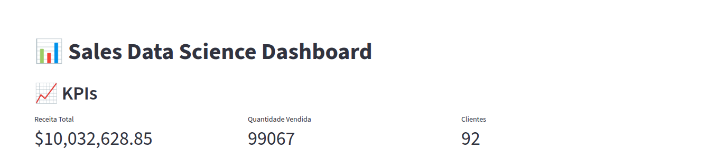
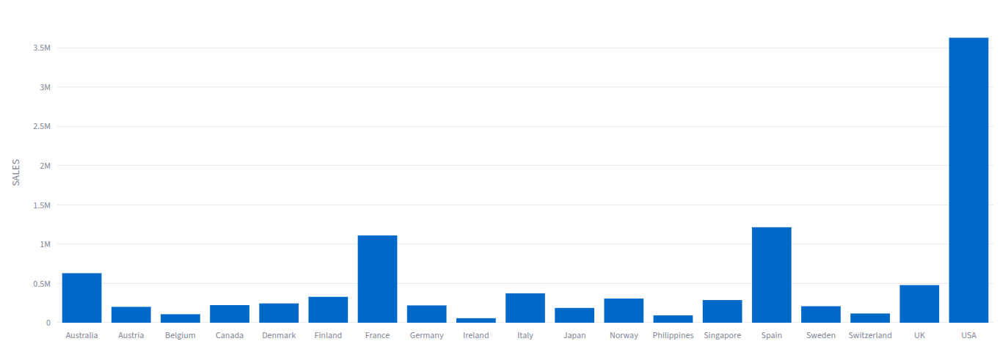
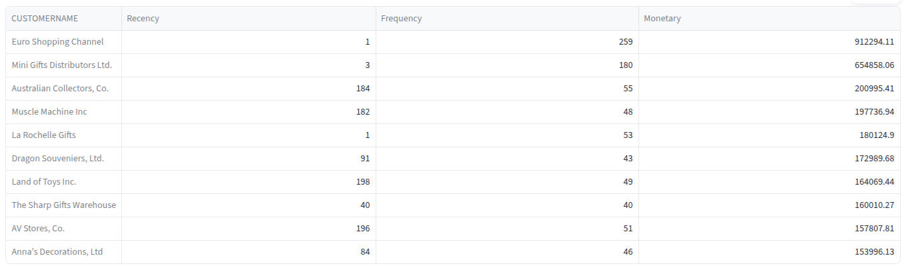
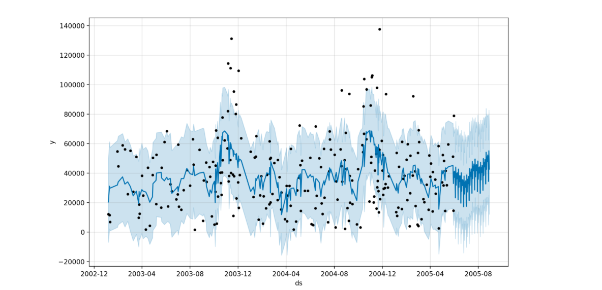

# 📊 Sales Data Science Dashboard

Dashboard interativo de análise de vendas com previsão e segmentação de clientes.

## 🚀 Features

- KPIs de negócio
- Forecast de vendas
- Segmentação RFM
- Insights automáticos
- Visualização interativa

## 🛠 Stack

- Python
- Streamlit
- Plotly
- Prophet
- Pandas

## ▶️ Run

pip install -r requirements.txt
streamlit run app.py

## Layout

### 📈 KPIs

<p align="center">
  <br>
</p>

### 🌎 Vendas por País

<p align="center">
  <br>
</p>

### 👥 Segmentação de Clientes

<p align="center">
  <br>
</p>

### 🔮 Previsão de Vendas

<p align="center">
  <br>
</p>

## ⭐ Estrutura do projeto

```
sales-ds-dashboard/
│
├── app.py
├── requirements.txt
├── README.md
│
├── data/
│   └── sales_data.csv
│
├── src/
│   ├── data_loader.py
│   ├── kpi.py
│   ├── rfm.py
│   ├── forecast.py
│   ├── insights.py
│
├── assets/
│   ├── KPIs.png
│   ├── Vendas_por_Pais.png
|   ├── Segmentacao.png
|   ├── Previsao.png
